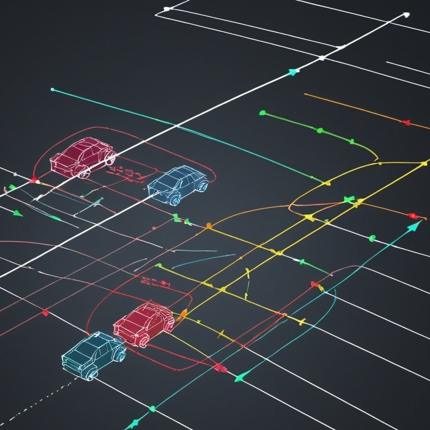

<html lang="en">
<head>
    <meta charset="UTF-8">
    <meta name="viewport" content="width=device-width, initial-scale=1.0">
    
</head>
<body>
    

        

            
            
I am a Ph.D. algorithm developer specializing in optimization problems within deep and machine learning, signal processing, data science, statistics, operations research, mathematics, and other related domains.    My projects and ongoing endeavors, which include links to code repositories with detailed comments and PDF files, are listed below. Feel free to explore the provided links and don't hesitate to reach out to me for further information.

        

        

            

                <h2>Publications</h2>
                

                    

                        
                        

                            <h3>Fast Sensor Network Localization</h3>
                            
A novel fast distributed and parallel method for wireless sensor network localization with data uncertainty.

                            
<strong>Keywords:</strong> Statistical Estimation, Distributed Parallel Computing, Optimization Algorithms

                            

                                <a href="https://github.com/eyalgur1/Fast_Network_Localization" target="_blank">GitHub</a>
                                <a href="pdf/FNL_paper.pdf" target="_blank">PDF</a>
                            

                        

                    

                    

 <!-- Add this separator -->
                    

                        
                        

                            <h3>Target Detection</h3>
                            
Detection of targets with a novel algorithm in an asynchronous environment using TDoA.

                            
<strong>Keywords:</strong> Source Localization and Detection, Fast Optimization

                            

                                <a href="https://www.sciencedirect.com/science/article/abs/pii/S1051200423001690" target="_blank">Full Text</a>
                                <a href="https://github.com/eyalgur1/TDoA_Source_Localization" target="_blank">GitHub</a>
                                <a href="pdf/TDOA.pdf" target="_blank">PDF</a>
                            

                        

                    

                    

 <!-- Add this separator -->
                    

                        
                        

                            <h3>Synchronization and Localization of Targets</h3>
                            
Simultaneously synchronizing and locating source targets with a novel and fast algorithm.

                            
<strong>Keywords:</strong> Source Synchronization, Statistical Estimation, Optimization Algorithms

                            

                                <a href="https://github.com/eyalgur1/Asynchronous_ToA_Source_Localization" target="_blank">GitHub</a>
                                <a href="pdf/TOA.pdf" target="_blank">PDF</a>
                            

                        

                    

                    

 <!-- Add this separator -->
                    

                        
                        

                            <h3>Wireless Sensor Network Localization</h3>
                            
Fully distributed to fully centralized novel algorithms for locating complex sensor networks.

                            
<strong>Keywords:</strong> Distributed Optimization, Parallel Computing, Network Simulations

                            

                                <a href="https://ieeexplore.ieee.org/abstract/document/9226609" target="_blank">Full Text</a>
                                <a href="https://github.com/eyalgur1/Sensor_Network_Localization" target="_blank">GitHub</a>
                                <a href="pdf/WSNL.pdf" target="_blank">PDF</a>
                            

                        

                    

                    

 <!-- Add this separator -->
                    

                        
                        

                            <h3>Image Deblurring</h3>
                            
Reconstructing a blurred image with a new algorithm with regularization.

                            
<strong>Keywords:</strong> Image Processing, Elastic Net, Image Reconstruction

                            

                                <a href="https://link.springer.com/article/10.1007/s10957-023-02310-4" target="_blank">Full Text</a>
                                <a href="https://github.com/eyalgur1/Image_Deblurring/tree/main/non_smooth" target="_blank">GitHub</a>
                                <a href="pdf/NAM2.pdf" target="_blank">PDF</a>
                            

                        

                    

                    

 <!-- Add this separator -->
                    

                        
                        

                            <h3>Nested Algorithm for Complex Optimization Problems</h3>
                            
A novel and practical algorithmic framework that solves non-convex optimization problems by nesting algorithms.

                            
<strong>Keywords:</strong> Optimization, Fast Algorithms, Analysis

                            

                                <a href="https://pubsonline.informs.org/doi/abs/10.1287/moor.2022.1256" target="_blank">Full Text</a>
                                <a href="https://github.com/eyalgur1/Image_Deblurring/tree/main/smooth" target="_blank">GitHub</a>
                                <a href="pdf/NAM1.pdf" target="_blank">PDF</a>
                            

                        

                    

                    

 <!-- Add this separator -->
                    

                        
                        

                            <h3>Optimality in Multi-Dimensional Scaling and Networks</h3>
                            
Optimality of solutions in the sensor networks and dimensionality reduction in unsupervised learning.

                            
<strong>Keywords:</strong> Heuristics for Optimality, Unsupervised Learning, Sensor Networks, Algorithm Analysis

                            

                                <a href="pdf/SNL.pdf" target="_blank">PDF</a>
                            

                        

                    

                

            

            

                <h2>Exploratory Projects</h2>
                

                    

                        
                        

                            <h3>Auto-Encoder Neural Network Optimizer</h3>
                            
An auto-encoder neural network with a custom optimizer developed to tackle a toy image encoding and decoding task for computer vision, compared to ADAM.

                            
<strong>Keywords:</strong> Deep Learning, Optimizers, Image Processing, Computer Vision, Python

                            

                                <a href="https://github.com/eyalgur1/AutoEncoders" target="_blank">GitHub</a>
                                <a href="pdf/AE.pdf" target="_blank">PDF</a>
                            

                        

                    

                    

 <!-- Add this separator -->
                    

                        
                        

                            <h3>Computer Vision</h3>
                            
Algorithms and deep learning techniques for computer vision tasks with explanations and code, following the Hugging Face CV Course.

                            
<strong>Keywords:</strong> Deep Learning, Feature Matching, Convolution Neural Networks, Transformers

                            

                                <a href="https://github.com/eyalgur1/Computer_Vision__Huggning_Face_Community_CV_Course" target="_blank">GitHub</a>
                                <a href="pdf/CV.pdf" target="_blank">PDF</a>
                            

                        

                    

                    

 <!-- Add this separator -->
                    

                        
                        

                            <h3>Large Language Model for NLP</h3>
                            
The transformer architecture of large language models for Natural Languge Processing explained from a mathematical perspective.

                            
<strong>Keywords:</strong> NLP, LLM, PyTorch, Transformers

                            

                                <a href="https://github.com/eyalgur1/Large_Language_Models_Explained" target="_blank">GitHub</a>
                                <a href="pdf/LLM.pdf" target="_blank">PDF</a>
                            

                        

                    

                    

 <!-- Add this separator -->
                    

                        
                        

                            <h3>Machine Learning Techniques</h3>
                            
Foundational techniques in machine learning for data science with explanations and python code.

                            

                                <a href="https://github.com/eyalgur1/Machine_Learning_Techniques" target="_blank">GitHub</a>
                            

                        

                    

                    

 <!-- Add this separator -->
                    

                        
                        

                            <h3>Radar Signal Processing</h3>
                            
Detecting a moving target using Doppler maps with python code and explanations.

                            
<strong>Keywords:</strong> Radar, Detection, Doppler Map, Python

                            

                                <a href="https://github.com/eyalgur1/Radar_Signal_Processing" target="_blank">GitHub</a>
                                <a href="pdf/Radar_Signal_Processing.pdf" target="_blank">PDF</a>
                            

                        

                    

                    

 <!-- Add this separator -->
                    

                        
                        

                            <h3>Motion Planning</h3>
                            
Motion and path planning of a robot that maps corners in constant speed, with explanations.

                            
<strong>Keywords:</strong> Motion Planning, Path Planning, Non-Smooth

                            

                                <a href="https://github.com/eyalgur1/Path_Planning_for_Corner" target="_blank">GitHub</a>
                                <a href="pdf/PL.pdf" target="_blank">PDF</a>
                            

                        

                    

                

            

        

    

</body>
</html>
