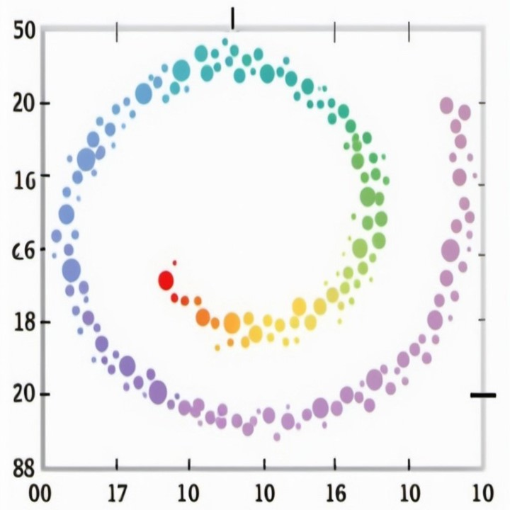
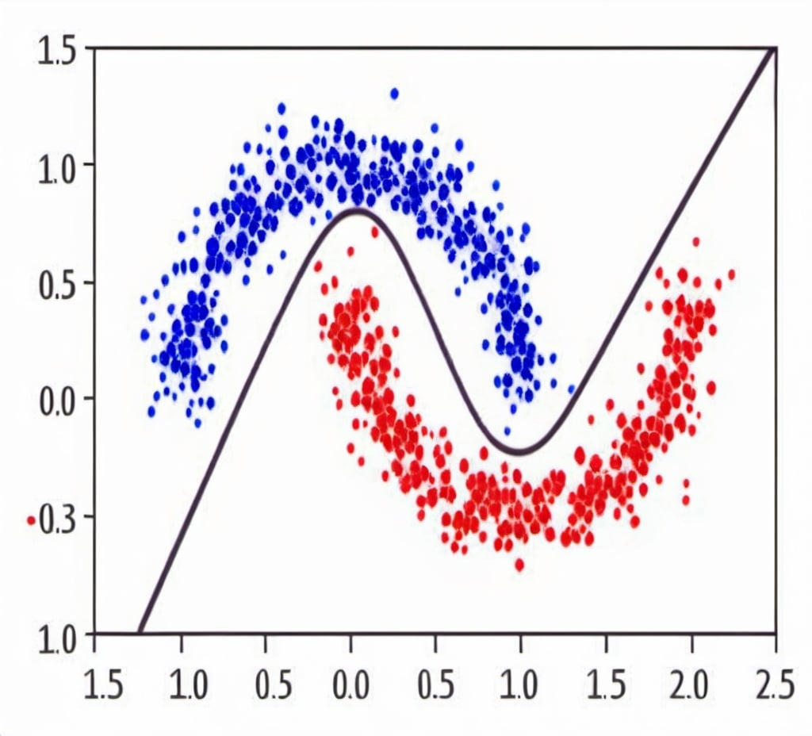

<!DOCTYPE html>
<html lang="en">
<head>
    <meta charset="UTF-8">
    <meta name="viewport" content="width=device-width, initial-scale=1.0">
    <title>Eyal Gur - Projects</title>
    
</head>
<body>
    <header>
        <h1>Eyal Gur - Projects</h1>
    </header>
    

        

            
            
I am currently pursuing a PhD in Data Science and Optimization, focusing on developing innovative solutions in machine learning, statistical estimation, and optimization algorithms.

        

        

            

                <h2>Publications</h2>
                

                    

                        
                        

                            <h3>Sensor Network Localization</h3>
                            
A novel fast distributed and parallel method for wireless sensor network localization with data uncertainty.

                            
<strong>Keywords:</strong> Statistical Estimation, Distributed Parallel Computing, Optimization Algorithms

                            

                                <a href="https://link-to-publication.com" target="_blank">Full Text</a>
                                <a href="https://github.com/eyalgur/sensor-network-localization" target="_blank">GitHub</a>
                                <a href="path/to/sensor_network_publication.pdf" target="_blank">PDF</a>
                            

                        

                    

                    

                        
                        

                            <h3>Target Detection</h3>
                            
Detection of targets with a novel algorithm in an asynchronous environment using TDoA.

                            
<strong>Keywords:</strong> Source Localization and Detection, Fast Optimization

                            

                                <a href="https://link-to-publication.com" target="_blank">Full Text</a>
                                <a href="https://github.com/eyalgur/target-detection" target="_blank">GitHub</a>
                                <a href="path/to/target_detection_publication.pdf" target="_blank">PDF</a>
                            

                        

                    

                    

                        
                        

                            <h3>Synchronization and Localization of Targets</h3>
                            
Simultaneously synchronizing and locating source targets with a novel and fast algorithm.

                            
<strong>Keywords:</strong> Source Synchronization, Statistical Estimation, Optimization Algorithms

                            

                                <a href="https://link-to-publication.com" target="_blank">Full Text</a>
                                <a href="https://github.com/eyalgur/synchronization-localization" target="_blank">GitHub</a>
                                <a href="path/to/synchronization_localization_publication.pdf" target="_blank">PDF</a>
                            

                        

                    

                    

                        
                        

                            <h3>Wireless Sensor Network Localization</h3>
                            
Fully distributed to fully centralized novel algorithms for locating complex sensor networks.

                            
<strong>Keywords:</strong> Distributed Optimization, Parallel Computing, Network Simulations

                            

                                <a href="https://link-to-publication.com" target="_blank">Full Text</a>
                                <a href="https://github.com/eyalgur/wireless-sensor-network-localization" target="_blank">GitHub</a>
                                <a href="path/to/wireless_sensor_network_publication.pdf" target="_blank">PDF</a>
                            

                        

                    

                    

                        
                        

                            <h3>Image Deblurring</h3>
                            
Reconstructing a blurred image with a new algorithm with regularization.

                            
<strong>Keywords:</strong> Image Processing, Elastic Net, Image Reconstruction

                            

                                <a href="https://link-to-publication.com" target="_blank">Full Text</a>
                                <a href="https://github.com/eyalgur/image-deblurring" target="_blank">GitHub</a>
                                <a href="path/to/image_deblurring_publication.pdf" target="_blank">PDF</a>
                            

                        

                    

                    

                        
                        

                            <h3>Neted Alternating Minimization</h3>
                            
A novel and practical algorithmic framework that solves complex optimization problems.

                            
<strong>Keywords:</strong> Optimization, Fast Algorithms, Analysis

                            

                                <a href="https://link-to-publication.com" target="_blank">Full Text</a>
                                <a href="https://github.com/eyalgur/neted-alternating-minimization" target="_blank">GitHub</a>
                                <a href="path/to/neted_alternating_minimization_publication.pdf" target="_blank">PDF</a>
                            

                        

                    

                    

                        
                        

                            <h3>Optimality in Networks and Multi-Dimensional Scaling</h3>
                            
Optimality of solutions in the sensor networks and dimensionality reduction in unsupervised learning.

                            
<strong>Keywords:</strong> Heuristics for Optimality, Unsupervised Learning, Sensor Networks, Algorithm Analysis

                            

                                <a href="https://link-to-publication.com" target="_blank">Full Text</a>
                                <a href="https://github.com/eyalgur/optimality-networks-scaling" target="_blank">GitHub</a>
                                <a href="path/to/optimality_networks_scaling_publication.pdf" target="_blank">PDF</a>
                            

                        

                    

                

            

            

                <h2>Exploratory Projects</h2>
                

                    

                        
                        

                            <h3>AutoEncoder Optimizer</h3>
                            
An auto-encoder neural network with a custom optimizer developed to tackle a toy image encoding and decoding task for computer vision, compared to ADAM.

                            
<strong>Keywords:</strong> Deep Learning, Optimizers, Image Processing, Computer Vision, Python

                            

                                <a href="https://github.com/eyalgur/autoencoder-optimizer" target="_blank">GitHub</a>
                            

                        

                    

                    

                        
                        

                            <h3>Computer Vision</h3>
                            
Algorithms and deep learning techniques for computer vision tasks with explanations and code, following the Hugging Face CV Course.

                            
<strong>Keywords:</strong> Deep Learning, Feature Matching, Convolution Neural Networks, Transformers

                            

                                <a href="https://github.com/eyalgur/computer-vision" target="_blank">GitHub</a>
                                <a href="path/to/computer_vision.pdf" target="_blank">PDF</a>
                            

                        

                    

                    

                        
                        

                            <h3>Natural Language Processing</h3>
                            
The transformer architecture for large language models explained from a mathematical perspective.

                            
<strong>Keywords:</strong> NLP, LLM, PyTorch, Transformers

                            

                                <a href="https://github.com/eyalgur/natural-language-processing" target="_blank">GitHub</a>
                                <a href="path/to/natural_language_processing.pdf" target="_blank">PDF</a>
                            

                        

                    

                    

                        
                        

                            <h3>Machine Learning Techniques</h3>
                            
Foundational techniques in machine learning for data science with explanations and python code.

                            

                                <a href="https://github.com/eyalgur/machine-learning-techniques" target="_blank">GitHub</a>
                            

                        

                    

                    

                        
                        

                            <h3>Radar Signal Processing</h3>
                            
Detecting a moving target using Doppler maps with python code and explanations.

                            
<strong>Keywords:</strong> Radar, Detection, Doppler Map, Python

                            

                                <a href="https://github.com/eyalgur/radar-signal-processing" target="_blank">GitHub</a>
                                <a href="path/to/radar_signal_processing.pdf" target="_blank">PDF</a>
                            

                        

                    

                    

                        
                        

                            <h3>Motion Planning</h3>
                            
Motion planning of a robot that maps corners in constant speed, with explanations.

                            
<strong>Keywords:</strong> Motion Planning, Path Planning, Non-Smooth

                            

                                <a href="https://github.com/eyalgur/motion-planning" target="_blank">GitHub</a>
                                <a href="path/to/motion_planning.pdf" target="_blank">PDF</a>
                            

                        

                    

                

            

        

    

</body>
</html>
